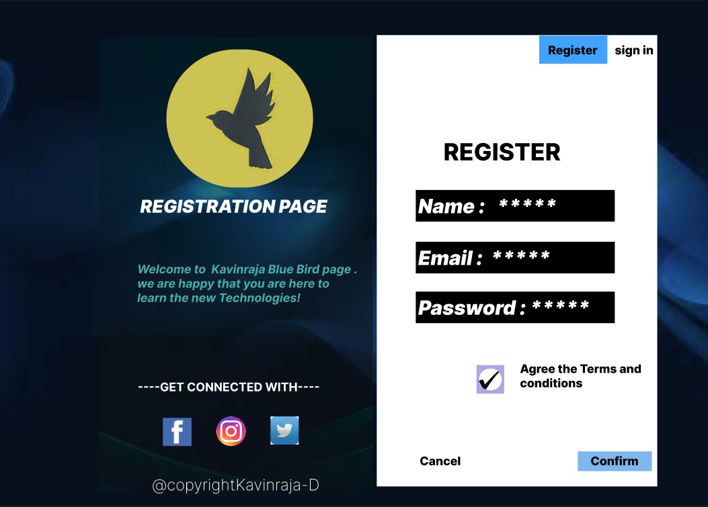
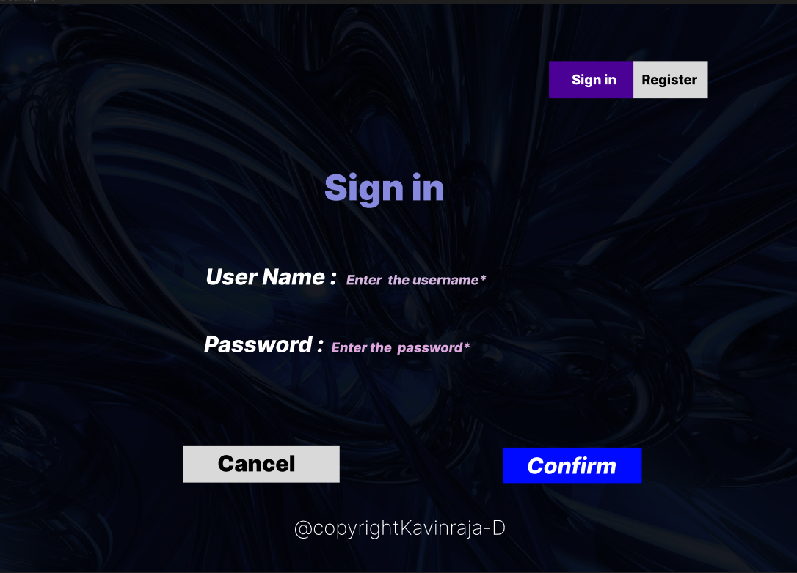
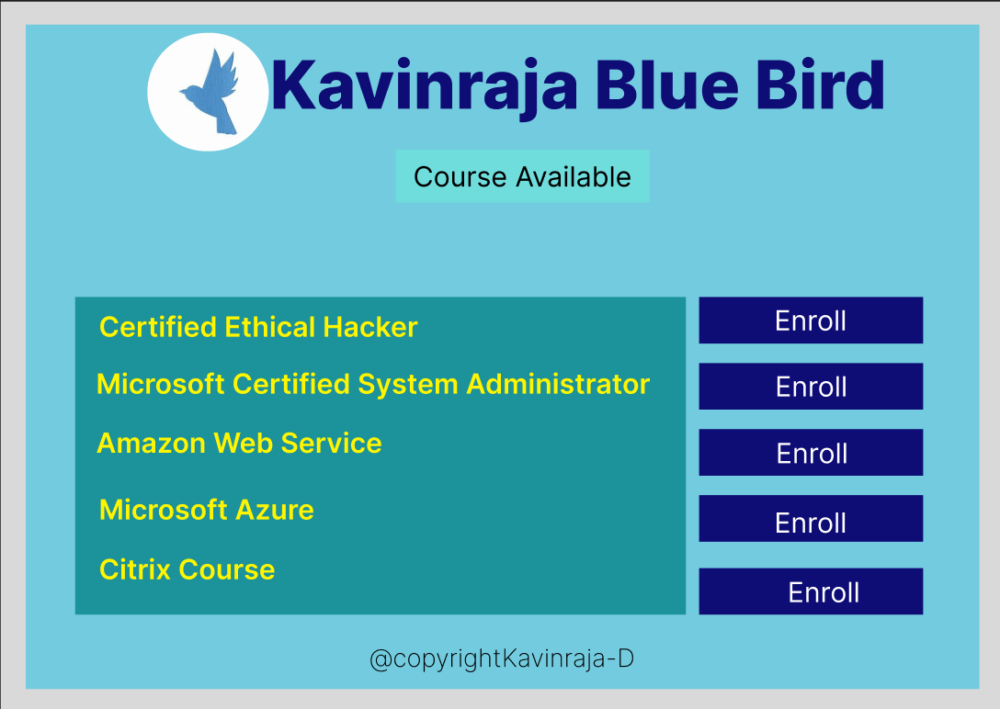

# Event Registration Web Application

## AIM:
To design, develop and deploy a web application for event registration.

## DESIGN STEPS:

### Step 1:
create a new frame.


### Step 2:
select any one present size of your choice


### Step 3:
select the shape you needed.

### Step 4:
Import images as needed and create pages based on your need and link there.


### Step 5:
Validate the HTML and CSS code.

### Step 6:

Publish the website in the given URL.

## DESIGN:
FIGMA 

## PROGRAM :
### Registration Page
```cs
/* OIP 1 */


position: absolute;
width: 1456px;
height: 1024px;
left: 0px;
top: 0px;

background: url(OIP.jpg);


/* download 1 */


position: absolute;
width: 555px;
height: 920px;
left: 202px;
top: 76px;

background: url(download.jpg);
opacity: 0.5;


/* OIP 2 */


position: absolute;
width: 57px;
height: 57px;
left: 550px;
top: 843px;

background: url(OIP.jpg);


/* OIP 3 */


position: absolute;
width: 60px;
height: 60px;
left: 440px;
top: 843px;

background: url(OIP.jpg);
border-radius: 60px;


/* Rectangle 1 */


position: absolute;
width: 568px;
height: 915px;
left: 765px;
top: 70px;

background: #FFFFFF;


/* Rectangle 8 */


position: absolute;
width: 150px;
height: 40px;
left: 1172px;
top: 914px;

background: #7DB7ED;


/* Confirm */


position: absolute;
width: 97px;
height: 29px;
left: 1198px;
top: 919px;

font-family: 'Inter';
font-style: normal;
font-weight: 800;
font-size: 24px;
line-height: 29px;
/* identical to box height */


color: #000000;


/* OIP 4 */


position: absolute;
width: 58px;
height: 57px;
left: 332px;
top: 846px;

background: url(OIP.jpg);


/* ----GET CONNECTED WITH---- */


position: absolute;
width: 405px;
height: 103px;
left: 281px;
top: 769px;

font-family: 'Inter';
font-style: normal;
font-weight: 700;
font-size: 24px;
line-height: 29px;

color: #FFFFFF;


/* Welcome to Kavinraja Blue Bird page . we are happy that you are here to learn the new Technologies! */


position: absolute;
width: 448px;
height: 120px;
left: 280px;
top: 530px;

font-family: 'Inter';
font-style: italic;
font-weight: 700;
font-size: 24px;
line-height: 29px;

color: #49ABA5;


/* Text */


position: absolute;
width: 0px;
height: 29px;
left: 632px;
top: 674px;


/* REGISTRATION PAGE */


position: absolute;
width: 427px;
height: 42px;
left: 286px;
top: 395px;

font-family: 'Inter';
font-style: italic;
font-weight: 900;
font-size: 36px;
line-height: 44px;

color: #FFFFFF;


/* REGISTER */


position: absolute;
width: 294px;
height: 61px;
left: 900px;
top: 278px;

font-family: 'Inter';
font-style: normal;
font-weight: 800;
font-size: 48px;
line-height: 58px;

color: #000000;


/* Rectangle 2 */


position: absolute;
width: 403px;
height: 64px;
left: 844px;
top: 384px;

background: #000000;


/* Name : ***** */


position: absolute;
width: 289px;
height: 48px;
left: 849px;
top: 392px;

font-family: 'Inter';
font-style: italic;
font-weight: 900;
font-size: 40px;
line-height: 48px;

color: #FFFFFF;


/* Rectangle 3 */


position: absolute;
width: 403px;
height: 64px;
left: 844px;
top: 590px;

background: #000000;


/* Rectangle 4 */


position: absolute;
width: 403px;
height: 64px;
left: 844px;
top: 489px;

background: #010101;


/* Email : ***** */


position: absolute;
width: 289px;
height: 48px;
left: 849px;
top: 497px;

font-family: 'Inter';
font-style: italic;
font-weight: 900;
font-size: 40px;
line-height: 48px;

color: #FFFFFF;


/* Password : ***** */


position: absolute;
width: 383px;
height: 48px;
left: 849px;
top: 598px;

font-family: 'Inter';
font-style: italic;
font-weight: 900;
font-size: 40px;
line-height: 48px;

color: #FFFFFF;


/* Text */


position: absolute;
width: 0px;
height: 48px;
left: 1202px;
top: 284px;


/* Rectangle 5 */


position: absolute;
width: 138px;
height: 57px;
left: 1094px;
top: 71px;

background: #3FA3FF;


/* Rectangle 6 */


position: absolute;
width: 93px;
height: 57px;
left: 1232px;
top: 75px;

background: #FFFFFF;


/* sign in */


position: absolute;
width: 79px;
height: 29px;
left: 1247px;
top: 86px;

font-family: 'Inter';
font-style: normal;
font-weight: 800;
font-size: 24px;
line-height: 29px;
/* identical to box height */


color: #000000;


/* Register */


position: absolute;
width: 101px;
height: 29px;
left: 1112px;
top: 86px;

font-family: 'Inter';
font-style: normal;
font-weight: 800;
font-size: 24px;
line-height: 29px;
/* identical to box height */


color: #000000;


/* Rectangle 7 */


position: absolute;
width: 183px;
height: 56px;
left: 808px;
top: 906px;

background: rgba(255, 255, 255, 0.3);


/* Cancel */


position: absolute;
width: 142px;
height: 39px;
left: 852px;
top: 919px;

font-family: 'Inter';
font-style: normal;
font-weight: 800;
font-size: 24px;
line-height: 29px;

color: #000000;


/* Rectangle 9 */


position: absolute;
width: 56px;
height: 58px;
left: 967px;
top: 739px;

background: #ACA7E4;


/* Agree the Terms and conditions */


position: absolute;
width: 286px;
height: 27px;
left: 1055px;
top: 732px;

font-family: 'Inter';
font-style: normal;
font-weight: 800;
font-size: 24px;
line-height: 29px;

color: #000000;


/* download 2 */


position: absolute;
width: 46px;
height: 44px;
left: 972px;
top: 746px;

background: url(download.jpg);
border-radius: 152.5px;


/* @copyrightKavinraja-D */


position: absolute;
width: 584px;
height: 67px;
left: 310px;
top: 962px;

font-family: 'Inter';
font-style: normal;
font-weight: 200;
font-size: 32px;
line-height: 39px;

color: #FFFFFF;


/* OIP 5 */


position: absolute;
width: 297px;
height: 280px;
left: 339px;
top: 99px;

background: url(OIP.jpg);
border-radius: 140px;
```
### Sign Page
```cs
/* A9rkblk 1 */


position: absolute;
width: 1440px;
height: 1024px;
left: 0px;
top: 0px;

background: url(A9rkblk.jpg);


/* @copyrightKavinraja-D */


position: absolute;
width: 500px;
height: 56px;
left: 530px;
top: 922px;

font-family: 'Inter';
font-style: normal;
font-weight: 200;
font-size: 36px;
line-height: 44px;

color: #FFFFFF;


/* Rectangle 2 */


position: absolute;
width: 163px;
height: 67px;
left: 989px;
top: 103px;

background: #4B0096;


/* Sign in */


position: absolute;
width: 81px;
height: 29px;
left: 1030px;
top: 122px;

font-family: 'Inter';
font-style: normal;
font-weight: 800;
font-size: 24px;
line-height: 29px;
/* identical to box height */


color: #FFFFFF;


/* Rectangle 3 */


position: absolute;
width: 134px;
height: 67px;
left: 1141px;
top: 103px;

background: #D9D9D9;


/* Register */


position: absolute;
width: 101px;
height: 29px;
left: 1156px;
top: 122px;

font-family: 'Inter';
font-style: normal;
font-weight: 800;
font-size: 24px;
line-height: 29px;
/* identical to box height */


color: #000000;


/* Sign in */


position: absolute;
width: 235px;
height: 95px;
left: 584px;
top: 292px;

font-family: 'Inter';
font-style: normal;
font-weight: 900;
font-size: 64px;
line-height: 77px;

color: #8689DD;


/* User Name : Enter the username* */


position: absolute;
width: 857px;
height: 71px;
left: 371px;
top: 467px;

font-family: 'Inter';
font-style: italic;
font-weight: 800;
font-size: 40px;
line-height: 48px;

color: #FFFFFF;


/* Password : Enter the password* */


position: absolute;
width: 907px;
height: 156px;
left: 368px;
top: 589px;

font-family: 'Inter';
font-style: italic;
font-weight: 800;
font-size: 40px;
line-height: 48px;

color: #FFFFFF;


/* Text */


position: absolute;
width: 0px;
height: 29px;
left: 1144px;
top: 343px;


/* Rectangle 4 */


position: absolute;
width: 249px;
height: 64px;
left: 907px;
top: 800px;

background: #000AFF;


/* Confirm */


position: absolute;
width: 162px;
height: 48px;
left: 949px;
top: 808px;

font-family: 'Inter';
font-style: italic;
font-weight: 800;
font-size: 40px;
line-height: 48px;

color: #FFFFFF;


/* Rectangle 5 */


position: absolute;
width: 282px;
height: 67px;
left: 330px;
top: 796px;

background: #D9D9D9;


/* Cancel */


position: absolute;
width: 238px;
height: 55px;
left: 392px;
top: 804px;

font-family: 'Inter';
font-style: normal;
font-weight: 900;
font-size: 40px;
line-height: 48px;

color: #000000;

```
### Course Page
```cs
/* Kavinraja Blue Bird */


position: absolute;
width: 1285px;
height: 205px;
left: 387px;
top: 61px;

font-family: 'Inter';
font-style: normal;
font-weight: 800;
font-size: 96px;
line-height: 116px;

color: #0E0C75;


/* OIP 1 */


position: absolute;
width: 174.53px;
height: 170.29px;
left: 209px;
top: 46.82px;

background: url(OIP.jpg);
border-radius: 117px;
transform: rotate(-1.26deg);


/* Rectangle 1 */


position: absolute;
width: 365px;
height: 76px;
left: 568px;
top: 213px;

background: #70DDDD;


/* Course Available */


position: absolute;
width: 315px;
height: 48px;
left: 593px;
top: 227px;

font-family: 'Inter';
font-style: normal;
font-weight: 400;
font-size: 40px;
line-height: 48px;

color: #000000;


/* Rectangle 2 */


position: absolute;
width: 1440px;
height: 33px;
left: 0px;
top: 0px;

background: #D9D9D9;

/* Rectangle 4 */

position: absolute;
width: 1440px;
height: 35px;
left: 0px;
top: 989px;

background: #D9D9D9;

/* Rectangle 5 */

position: absolute;
width: 33px;
height: 970px;
left: 1407px;
top: 19px;

background: #D9D9D9;

/* Rectangle 6 */

position: absolute;
width: 322px;
height: 67px;
left: 1004px;
top: 425px;

background: #0E0C75;

/* Rectangle 7 */

position: absolute;
width: 322px;
height: 67px;
left: 1004px;
top: 815px;

background: #0E0C75;

/* Rectangle 8 */

position: absolute;
width: 322px;
height: 67px;
left: 1004px;
top: 710px;

background: #0E0C75;

/* Rectangle 9 */

position: absolute;
width: 322px;
height: 67px;
left: 1004px;
top: 615px;

background: #0E0C75;

/* Rectangle 10 */

position: absolute;
width: 322px;
height: 67px;
left: 1004px;
top: 520px;

background: #0E0C75;

/* Enroll */

position: absolute;
width: 105px;
height: 48px;
left: 1112px;
top: 434px;

font-family: 'Inter';
font-style: normal;
font-weight: 400;
font-size: 40px;
line-height: 48px;

color: #FFFFFF;

/* Enroll */

position: absolute;
width: 105px;
height: 48px;
left: 1131px;
top: 825px;

font-family: 'Inter';
font-style: normal;
font-weight: 400;
font-size: 40px;
line-height: 48px;

color: #FFFFFF;

/* Enroll */

position: absolute;
width: 105px;
height: 48px;
left: 1112px;
top: 725px;

font-family: 'Inter';
font-style: normal;
font-weight: 400;
font-size: 40px;
line-height: 48px;

color: #FFFFFF;

/* Enroll */

position: absolute;
width: 105px;
height: 48px;
left: 1113px;
top: 529px;

font-family: 'Inter';
font-style: normal;
font-weight: 400;
font-size: 40px;
line-height: 48px;

color: #FFFFFF;

/* Enroll */

position: absolute;
width: 105px;
height: 48px;
left: 1114px;
top: 625px;

font-family: 'Inter';
font-style: normal;
font-weight: 400;
font-size: 40px;
line-height: 48px;

color: #FFFFFF;

/* @copyrightKavinraja-D */

position: absolute;
width: 584px;
height: 67px;
left: 530px;
top: 922px;

font-family: 'Inter';
font-style: normal;
font-weight: 200;
font-size: 36px;
line-height: 44px;

color: #000000;

/* Rectangle 11 */

position: absolute;
width: 878px;
height: 457px;
left: 107px;
top: 425px;

background: #1C929A;

/* Certified Ethical Hacker */

position: absolute;
width: 560px;
height: 47px;
left: 141px;
top: 443px;

font-family: 'Inter';
font-style: normal;
font-weight: 600;
font-size: 40px;
line-height: 48px;

color: #FFF500;

/* Microsoft Certified System Administrator */

position: absolute;
width: 863px;
height: 56px;
left: 137px;
top: 525px;

font-family: 'Inter';
font-style: normal;
font-weight: 600;
font-size: 40px;
line-height: 48px;

color: #FFF500;

/* Amazon Web Service */

position: absolute;
width: 610px;
height: 50px;
left: 137px;
top: 610px;

font-family: 'Inter';
font-style: normal;
font-weight: 600;
font-size: 40px;
line-height: 48px;

color: #FFF500;

/* Microsoft Azure */

position: absolute;
width: 471px;
height: 43px;
left: 141px;
top: 706px;

font-family: 'Inter';
font-style: normal;
font-weight: 600;
font-size: 40px;
line-height: 48px;

color: #FFF500;

/* Citrix Course */

position: absolute;
width: 431px;
height: 45px;
left: 141px;
top: 792px;

font-family: 'Inter';
font-style: normal;
font-weight: 600;
font-size: 40px;
line-height: 48px;

color: #FFF500;
```

## OUTPUT:




## Result:
The program to design .develope and display a web application for event registration is completed successfully.

